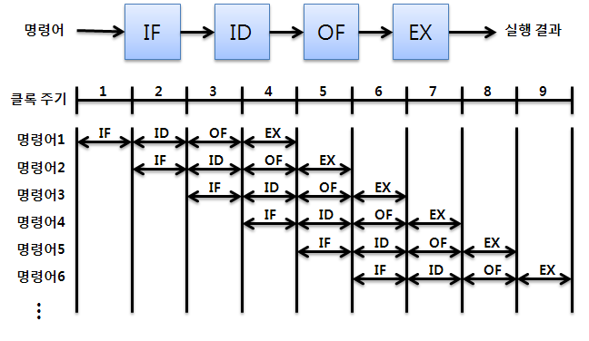
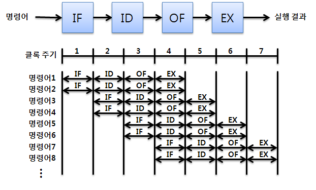

# 5.2 명령어 병렬 처리 기법
CPU의 성능을 높이기 위해 우리는 앞선 장에서 클럭 주기 빠르게 하기, 멀티 코어/스레드를 지원하게 하기 등 여러 방법을 알아보았다. 이번 장에서는 또 다른 성능향상의 길인 알뜰하게 CPU 작동하게 하기에 관해 알아보도록 하자.

## 명령어 병렬 처리 기법(instruction level parallelism)의 종류
1. 명령어 파이프라인(instruction pipeline)
2. 슈퍼스칼라(superscalar)
3. 비순차적 명령어 처리(Out-of-order excution)

## 1. 명령어 파이프라인
하나의 명령어가 실행되는 과정을 특정 시간을 기준으로 쪼개보자; 클럭 주기를 기준으로 쪼개게 되면 일반적으로 아래와 같이 4가지 단계로 쪼갤 수 있다(이것이 무조건 정답이 아니며 여러 교재들에 따라 다르게 표현할 수 있다).

1. 명령어 인출(instruction fetch)
2. 명령어 해석(instruction decode)
3. 명령어 실행(excute instruction)
4. 결과 저장(write back)

만약 cpu가 여러 명령어를 실행해야 하며 위 과정을 모두 마친 뒤 다음 명령어를 실행한다고 가정한다면 현재 우리가 사용하는 머신들의 성능이 믿어지겠는가? 어떻게 보면 가능하다고도 생각은 되겠지만 더 빠르게 하는 방법이 당연히 사용되고 있으리라 믿고있을 것이다. 

중요한 점은 cpu는 같은 단계가 겹치지만 않는다면 각 단계를 동시에 실행할 수 있다. 예를 들어 **한 명령어를 인출하는 동안 다른 명령어를 실행할 수 있고, 한 명령어를 실행하는 동안 연산 결과를 저장할 수 있다**. 



이처럼 명령어 파이프라인(instruction pipeline)에 명령어를 넣어 동시에 처리하는 기법을 명령어 파이프라이닝(instruction pipelining)이라고 한다.

### 1.1. 파이프라인 위험(pipeline harzard)
특정 상황에서는 파이프라이닝이 성능 향상을 실패하는 경우도 있다. 이러한 상황을 파이프라인 위험이라 부르며 종류는 다음과 같다.
1. 데이터 위험(data harzard)
2. 제어 위험(control harzard)
3. 구조적 위험(structural harzard)

**데이터 위험**

데이터 위험은 명령어들이 의존성을 띄게 될 때 생기게 된다. 
```
명령어1 : a=1
명령어2 : b=2
명령어3 : a+b
``` 
위와 같은 명령어들이 파이프라이닝을 통해 실행될 때, 명령어 1,2는 의존성을 갖지 않으므로 정상적으로 파이프라이닝을 수행할 수 있지만, 명령어3의 경우 명령어2가 '명령어 해석'단계를 거칠 때 '명령어 인출'을 수행하려 할 시 b값이 저장되지 않았기 때문에 명령어를 실행할 수 없고 명령어1,2가 마치기를 기다려야 한다. 

이처럼 의존적인 명령어를 무작정 동시에 실행하려고 할 때 파이프라인이 제대로 동작하지 않는 것을 데이터 위험이라고 한다.

**제어 위험**

위의 image1처럼 메모리에 저장된 순서대로 명령어들을 파이프라인에 넣어 수행하다가 프로그램 실행 흐름이 바뀌어 프로그램 카운터 값에 갑작스러운 변화가 생기면 미리 가지고 와서 처리 중이였던 명령어들은 아무 쓸모가 없어지게 되는데 이를 제어 위험이라고 한다.

이를 해결하기 위해 사용하는 기술 중 하나가 분기 예측(branch prediction)으로 프로그램이 어디로 분기할지 미리 예측한 후 그 주소를 인출하는 기술이다.

**구조적 위험**

구조적 위험은 파이프라이닝 도중 서로 다른 명령어가 동시에 ALU, 레지스터 등 CPU 부품을 사용하려고 할 때 발생한다. 구조적 위험은 자원 위험(resource harzard)이라고도 부른다.

## 2. 슈퍼스칼라
슈퍼스칼라는 CPU에 여러개의 파이프라인을 사용하는 것을 의미한다. 즉, 공장 생산라인을 여러대 두는 것과 같다.



슈퍼스칼라 프로세서(슈퍼스칼라 구조로 명령어 처리가 가능한 CPU)는 매 클럭 주기마다 여러 명령어를 인출, 해석, 실행등을 할 수 있어야 한다. 가령 멀티스레드 프로세서는 한 번에 여러개의 명령어를 인출, 해석, 실행할 수 있기 때문에 슈퍼스칼라 구조를 사용할 수 있다.

## 3. 비순차적 명령어 처리
명령어를 무조건 순차적으로 실행하지 않고 때에따라 실행 순서를 바꾸어 실행하는 방법이다. 이전까지의 데이터 파이프라인, 슈퍼스칼라 기법은 순차적 실행 방식이였다.
```
메모리 N번지를 'M(N)'으로, 메모리 N번지에 M을 저장하라를 'M(N) <- M'으로 표기하겠다.

명령어1 : M(100) <- 1
명령어2 : M(101) <- 2
명령어3 : M(102) <- M(100) + M(101)
명령어4 : M(151) <- 1
명령어5 : M(152) <- 2
명령어6 : M(153) <- 3
```
위와 같은 명령어들이 있을 때 순차적으로 명령어를 실행한다면 명령어3이 의존성을 띄기 때문에 명령어1,2가 완료될 때까지 기다리게 되므로 당연히 명령어4,5,6 또한 기다리게 된다. 그러나 명령어 4,5,6은 의존성을 가지지 않기 때문에 비순차적 명령어 처리를 통해 명령어 처리 순서를 바꿔 성능 향상을 도모할 수 있다.

```
명령어1 : M(100) <- 1
명령어2 : M(101) <- 2
명령어4 : M(151) <- 1
명령어5 : M(152) <- 2
명령어6 : M(153) <- 3
명령어3 : M(102) <- M(100) + M(101)
```

이렇게 순차적으로만 실행하지 않고 순서를 바꿔 실행하도 무방한 명령어를 먼저 실행하여 명령어 파이프라인이 멈추는 것을 방지하는 기법을 비순차적 명령어 처리 기법이라고 한다.

------
### 출처
* 혼공컴운 교재
* https://www.harucat.com/entry/%EB%AA%85%EB%A0%B9%EC%96%B4-%ED%8C%8C%EC%9D%B4%ED%94%84%EB%9D%BC%EC%9D%B4%EB%8B%9D
* https://www.harucat.com/entry/%EB%AA%85%EB%A0%B9%EC%96%B4-%ED%8C%8C%EC%9D%B4%ED%94%84%EB%9D%BC%EC%9D%B4%EB%8B%9D-2