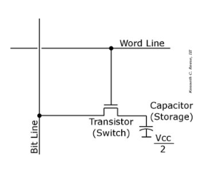
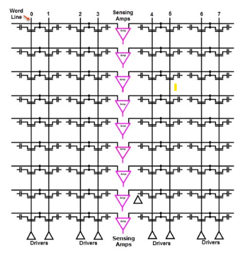

# DRAM
## Dynamic Random Access Memory

DRAM의 전기신호 1bit를 저장하는 셀의 형태이다. 1개의 transistor와 capacitor로 구성된 것을 볼 수 있다. 

그리고 위 셀들이 2차원 배열 형태로 나열되며 bit line과 word line으로 연결된 것을 볼 수 있다.

데이터를 쓰고자 할 때, 주소가 포함된 word lien에 전류가 흐른다. 그러면 셀 내의 transistor가 on되고 원하는 주소 셀의 capacitor와 bit line이 연결된다. bit line을 이용해 capacitor를 충전(1bit 저장), 방전(0bit 저장)하여 데이터를 쓸 수 있다.

읽을 때도 마찬가지로 word line에 전류가 흘러 transistor가 on되고 bit line이 capacitor와 연결되어 전압의 변화를 파악하여 셀에 저장된 신호를 파악한다.

## 왜 Dynamic인가

DRAM의 capacitor는 시간이 지날수록 전하가 방전되어 특정 간격마다 refresh를 해 주어야 한다. refresh를 하지 않을 시 capacitor에 가해지는 전압이 변하게 되어 저장된 데이터가 손실될 수 있다. 따라서 dynamic이라고 불린다.

---

### 출처

- https://computing-jhson.tistory.com/21
- https://sshmyb.tistory.com/158