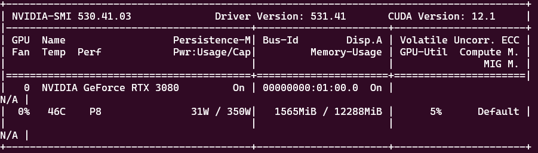

# VRAM
## Vidio Random Access Memory

모니터에 그래픽을 렌더링하고 표시하는데 필요한 데이터와 명령을 저장하고 빠르게 액세스할 수 있도록 설계된 메모리이다. 

GPU가 하드에서 직접 정보를 가져오는 것이 아니라 VRAM에 임시 저장하는 것으로 보다 더 빠르게 화면을 불러와 성능에 영향을 주게 된다; 앞으로 보여질 텍스쳐를 VRAM에 먼저 로드한 후 렌더링을 하므로 GPU에서 보다 더 빠른 처리가 가능해진다.

## VRAM의 크기 확인

linux를 기준으로 설명하면 터미널에서 “nvidia-smi”명령어를 입력해 사용자의 머신에 설치된 GPU정보를 확인할 수 있는데, “Memory-Usage”를 통해 확인이 가능하다.

-------

### 출처

- https://crone.tistory.com/605
- https://quasarzone.com/bbs/qf_vga/views/801936