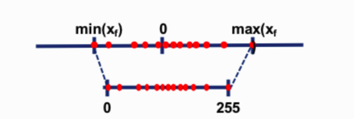

# 8-bit quantization
기존 FP32 → FP16/BF16 변환은 inference 성능을 많이 떨어뜨리지 않으며 모델의 크기를 절반으로 줄일 수 있었다. 이 놀라운 발견에 더 적은 precision으로의 quantization이 시도되었으나 성능도 함께 떨어지는 상황이 생겨났다.

## quantization

quantization은 근본적으로 한 데이터 타입에서 다른 데이터 타입으로 rounding하는 것이다. 예를 들어 한 데이터 타입의 범위가 0~9이고 다른 데이터 타입은 0~4라고 하자. 이때 첫 데이터 타입의 “4”는 두 번째 데이터 타입의 “2”로 round된다. 

quantization은 압축손실과 같은 정보 소실이 일어날 수 있는 noisy process이다. 위 예시의 첫 데이터 타입 “4”가 두 번째 데이터 타입에서는 “2”로 round된 것 처럼, 첫 데이터 타입 “3” 또한 두 번째 데이터 타입에서는 “2”로 round 되버린다.

## zero-point quantization

현재 가지고 있는 데이터의 범위가 -1~1이라 하고 변환하고 싶은 데이터 범위가 -127~127이라 할 때, 127의 인수로 배율을 조정한 후 8bit precision으로 반올림 할 것이다. 다시 원래 값으로 변환해 줄 때는 int8 값을 127의 동일한 quantization 인수로 나눠주면 된다. 

0.3을 변환하고 싶을 때는, 0.3 * 127 = 38.1이 되고, 38.1 / 127 = 0.2992로 다시 원복이 된다. 하지만 예시를 통해 알 수 있듯이 원복 시 약간의 quantization error가 발생한다. 또한 이 작은 에러가 쌓이고 쌓일 경우 model의 성능이 하락될 수 있다.

from https://huggingface.co/blog/hf-bitsandbytes-integration

## absmax quantization

absmax quantization을 통해 fp16의 숫자를 int8의 숫자로 연산해 주시 위해서는 먼저 tensor의 absolute maximum 값으로 나눠주고 이후 data type의 전체 범위를 곱해 주어야 한다.

[1.2, -0.5, -4.3, 1.2, -3.1, 0.8, 2.4, 5.4]를 가진 vector를 absmax quantization을 수행해 준다고 하면, 먼저 absolute maximum 값인 5.4를 추출해 준다. int8의 range는 [-127, 127] 이므로 127을 5.4로 나눈 23.5를 scaling factor로 얻게 된다. 그러므로 이 scaling factor를 원본 벡터에 곱해줌으로써 quantized vector [28, -12, -101, 28, -73, 19, 56, 127]를 얻게 된다.

from https://huggingface.co/blog/hf-bitsandbytes-integration