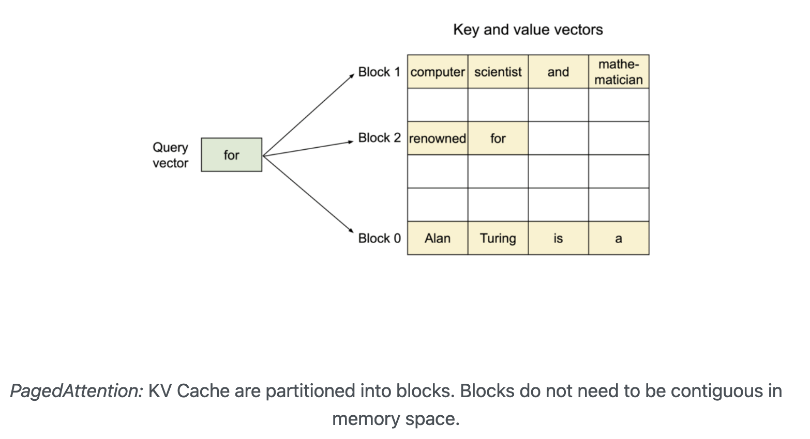
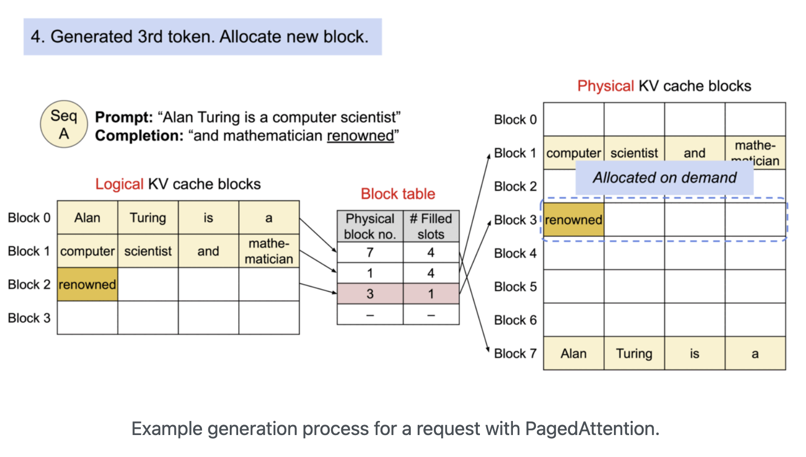
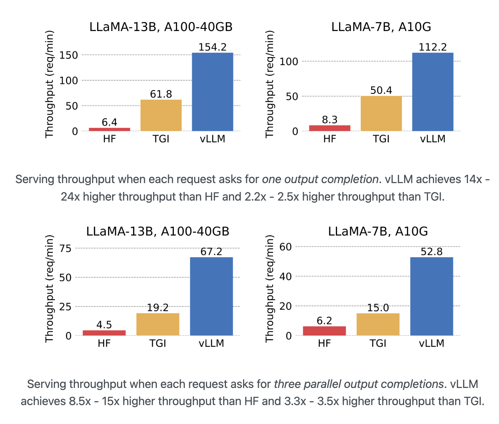
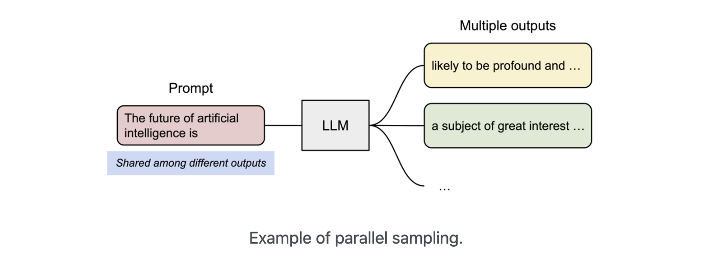

# Paged Attention
LLM serving의 성능은 메모리 크기에 의해 좌우된다. Autoregressive decoding 과정에서, LLM의 input으로 주어지는 input token들은 key, value tensor를 생성하고, 다음 token을 생성하기 위해 GPU memory에 저장해둔다. 이 key value tensor를 KV cache라고 한다.

## KV cache
* Large : LLaMA 13B 모델의 경우 단일 sequence를 처리하는데 1.7GB의 메모리를 차지한다.
* Dynamic : KV cache의 크기는 sequence의 길이에 의해 좌우되는데, 이는 매우 다양한 케이스가 있을 것이며 예측하기가 매우 힘들다. 따라서 효과적으로 KV cache를 다루는 것은 매우 힘든 작업이다. 또한 저자들은 현재 존재하는(23.06.20) system들은 60~80%의 memory를 fragmentation, over-reservation 때문에 낭비하고 있는 것을 발견했다고 한다.

## what is Paged Attention?
위에서 언급한 문제를 해결하기 위해 Paged Attention을 소개한다. Paged Attention은 virtual memory와 OS의 paging의 개념에서 영감을 받아 연구되었다. 

기존의 attention algorithm과는 다르게 Paged Attention은 연속된(contiguous) key, value들을 연속적이지 않은(non-contiguous) memory 공간에 저장한다. 특히 각 sequence의 KV cache를 고정된 수의 token에 해당하는 key-value로 나누어 block으로 저장한다.

block들이 memory 내에 연속적으로 적재되지 않아도 됨으로써 keys, values를 OS의 virtual memory처럼 더 유연하게 다룰 수 있게 되었다: 

우리는 block을 page로, token을 byte로, sequence를 process로 생각해볼 수 있다. Sequence의 연속 논리 block(contiguous logical block)들은 "Block table"을 통해 불연속적 물리 block(non-contiguous physical block)들을 매핑함으로써 생성된다. 물리 block(physical block)은 새로운 토큰이 생성되면 필요시 생성된 token이 새로운 physical block 내에 할당된다(아래 추가 설명).

위 그림을 통해 physical block을 할당하는 것을 확인할 수 있다. Prompt로 "Alan Turing is a computer scientist"가 들어와 "and mathematician"을 생생했고 현재 "renowned" token을 생성한 상황이다. Prompt와 이전까지의 생성된 token들은 2개의 block으로 나뉘어져 Physical KV cache blocks의 1, 7번에 저장되어 있었다. 하지만 "renowned" token의 경우 Block 1의 수용량을 초과했고 따라서 새로운 physical block인 Block 3에 할당하게 된다.  

### Advantage
Paged Attention은 memory의 낭비가 sequence의 마지막 block에서만 일어난다. 실험 결과 이는 거의 최적화 memory 사용에 가까운 결과인 4% 아래의 손실을 보여주었다. 이는 system으로 하여금 더 많은 sequence를 동시에 처리할 수 있게 하고 GPU 사용량을 늘린다. 따라서 아래 그림과 같이 상당한 처리량 증가를 꾀할 수 있다(아래 그림에서의 vLLM이 paged attention을 적용한 라이브러리이다).

Paged Attention의 또다른 Advantage는 efficient memory sharing이다. 예를 들어 parallel sampling에서, 하나의 prompt에 대해 여러개의 output을 생성할 때이다. 이때, output sequence들 사이에서 prompt의 연산과 memory가 공유될 수 있을 것이다.

다른 sequence들은 해당하는 logical block을 동일한 physical block에 매핑해 block들을 공유할 수 있다. 안전한 연결을 확실하게 하기 위해 physical block의 reference count의 기록을 유지하고 또한 Copy-and-Write 매커니즘을 적용한다.

Efficient memory sharing을 통해 beam search, parallel sampling같은 complex sampling algorithm들의 memory overhead를 상당히 줄일 수 있다: beam search, parallel sampling의 경우 55% 정도까지 memory 사용을 줄일 수 있다고 하며 이는 번역 시 2.2배의 처리량을 증가시킬 수 있다고 한다.

--------
### 출처
* https://vllm.ai/