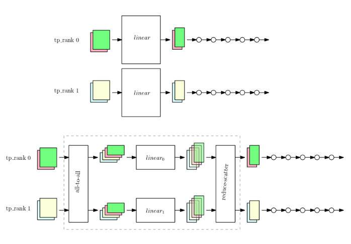

# Tensor Parallelism
Single GPU에 모델의 parameter를 적재할 수 없을 경우, 다중 GPU를 활용한 efficient training 방법인 DP(Data parallelism)와 DDP(Distributed Data parallelism)을 사용할 수 없다. 이때 사용 가능한 학습법에 pipeline parallelism, tensor parallelism 존재하는데 그중 Tensor parallism을 소개해 보겠다.

## 개념
Tensor parallelism은 pipeline parallelism과는 다르게 individual tensor를 나눈다(partition). 즉, module이 다중 data parallel rank로 나누어진다(보통 rank를 GPU라고 보는것 같다). 각 data parallel rank는 분산될(tensor parallelism이 적용 될) module들의 부분들과 분산되지 않을 module들의 전체 부분을 가지고 있을 것이다.

## Tensor parallelism의 동작

위 그림은 large model(linear layer)가 존재하는 상황에서 GPU에 모델 전체의 사본들을 적재하는 방법인 data parallelism과 tensor parallelism을 보여준다. 

중요하게 바라보아야 하는 점은 dp(data parallelism)은 각 GPU(tp_rank)에 모델 전체의 weight가 적재되는 반면, tensor parallelism은 대규모 모델인 linear를 쪼개(weight tensor를 쪼개는 기준은 row wise로 가정) 각각 적재시킨 것을 볼 수 있다.

또한 data sample들을 "all to all" 단계에서 합친 뒤 쪼개(data sample tensor는 column wise로 쪼개게 될 것) 각 GPU의 linear(기존 linear layer의 조각들)에 넣어 output을 만들고 다시 "reduce scatter" 단계에서 기존의 data sample 기준으로 복원시켜 준다.

-----
### 출처
* https://docs.aws.amazon.com/sagemaker/latest/dg/model-parallel-extended-features-pytorch-tensor-parallelism.html
* https://docs.aws.amazon.com/sagemaker/latest/dg/model-parallel-extended-features-pytorch-tensor-parallelism-how-it-works.html