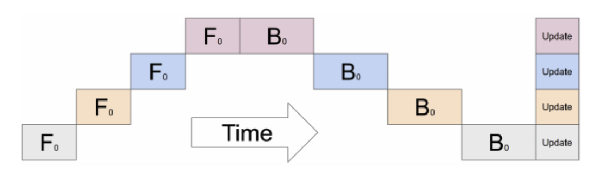
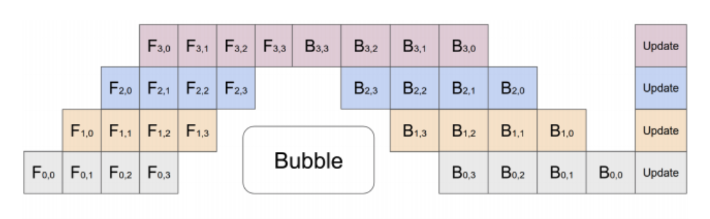

# Pipeline Parallelism
Pipeline parallelism은 Gpipe 논문에서 소개되었고, 다중 GPU를 사용한 대용량 모델 학습에 효과적인 기법입니다.
```
WARNING: Pipeline Parallelism은 실험단계이며 변경될 수 있습니다(23.10.01).
```

## Model Parallelism using multiple GPUs
일반적으로 대용량(Large) 모델은 단일 GPU이 감당할 수 없으므로, model parallism은 모델의 각 부분(part)들을 각각 다른 GPU에 할당하는 방법을 사용합니다. 하지만 아래의 그림처럼, 한 시간(one time)에 오직 하나의 GPU만 활성화되는 문제로 인해 학습 과정에 어려움이 있습니다.



위 그림은 4개의 layer를 가진 모델이 4개의 GPU에 분할되어 있는 것을 나타냅니다(수직 기준). 가로 축은 시간별로 모델이 오직 1개의 GPU만을 활성화하며 학습되어가는 것을 보여줍니다.

## Pipelined Execution
앞선 문제를 완화시키기 위해, pipeline parallelism은 input minibatch를 여러개의 microbatch로 쪼개 여러 GPU에 걸쳐 microbatch 실행을 파이프라인합니다. 이는 아래 그림에 표현되어 있습니다:



앞선 그림과 동일하게 4개의 layer로 구성된 모델을 4개의 GPU에 나누어 할당시켰습니다. 가로 축은 시간별로 모델이 더 효율적으로 학습하는 것을 보여줍니다. 하지만 여전히 bubble이라고 표현하는 특정 GPU들이 활성화되지 않는 구간이 존재합니다.
