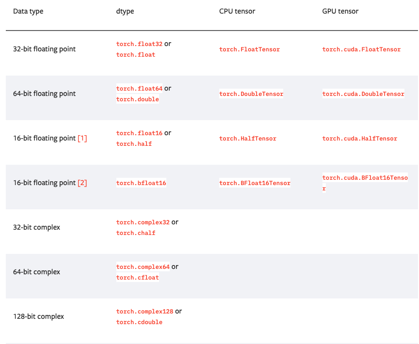
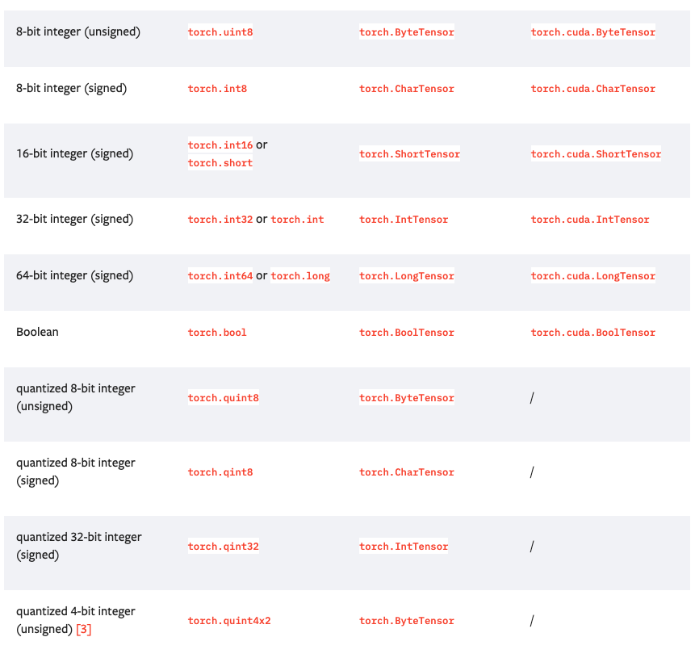

# torch.Tensor
-----

## Data types

Torch는 10개의 tensor 종류를 가지고 있고 각각 CPU, GPU버전으로 나뉘게 된다.





## Initializing and basic operations

tensor는 Python의 list나 sequence를 torch.tensor()을 사용해 생성할 수 있다.

```python
>>> torch.tensor([[1., -1.], [1., -1.]])
tensor([[ 1.0000, -1.0000],
        [ 1.0000, -1.0000]])
>>> torch.tensor(np.array([[1, 2, 3], [4, 5, 6]]))
tensor([[ 1,  2,  3],
        [ 4,  5,  6]])
```

torch.tensor()는 언제나 data를 복사한다. 만약 Tensor data를 가지고 있고 단지 requires_grad만 수정하고 싶을 경우, requires_grad_() 또는 detach()를 사용해 복사를 하지 않도록 한다. 또한 numpy array를 가지고 있고 복사를 피하고 싶을 때에는 torch.as_tensor()를 사용하면 된다.

tensor는 requires_grad=True를 가지고 생성될 수 있는데 이때, torch.autograd는 자동 미분을 위해 tensor의 연산을 저장한다.

```python
>>> x = torch.tensor([[1., -1.], [1., 1.]], requires_grad=True)
>>> out = x.pow(2).sum()
>>> out.backward()
>>> x.grad
tensor([[ 2.0000, -2.0000],
        [ 2.0000,  2.0000]])
```

각 tensor들은 관련된 torch.Storage(data를 저장한다)를 가지고 있다. 

```
Note: tensor를 변화시키는 method들은 _기호가 이름에 들어있다. torch.FloatTensor.abs_()의 경우, 절대값을 계산하고 치환해버린 뒤 수정된 Tensor를 반환하는 반면, torch.FloatTensor.abs()의 경우 결과를 연산하고 새로운 텐서에 넣어 반환한다.
```

------
### 출처
* https://pytorch.org/docs/stable/tensors.html