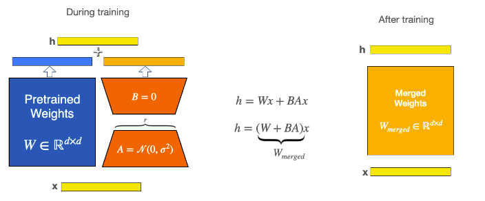

# LoRA
작은 matrix 2개(update_matrices라고 부른다)를 통해 weight를 업데이트한다. 이때, 기존의 weight(base model)들은 frozen되고 수정이 이루어지지 않는다.

## 장점
lora에는 몇가지 이점이 존재한다.
1. 학습가능 parameter를 매우 줄여서 효율적인 fine-tuning이 가능하다.
2. original pre-trained weight들은 frozen되고 각 task에 맞게 adapter(updaste matrices)만 바꿔주면 되므로 하나의 base weight와 여러개의 adapter를 전환해가며 다양한 task에 사용이 가능하다.
3. lora에 여러 parameter-efficient method를 더해서 사용이 가능하다.
4. fully-fine-tuned 모델들과 비교해도 성능이 어느정도 보장된다.
5. base model(pre-trained model)에 합쳐질 수 있어 inference latency가 추가되지 않는다.

## Merge LoRA weights into the base model
lora는 매우 작고 빠르나 inference 시 base model과 adapter를 로딩해주기에 latency가 생길 수 있다. Latency를 없애기 위해 merge_and_unload() method를 사용할 수 있다.
* merge_and_unload() : base model과 adapter를 합쳐주는 method.

그림에서처럼 학습 시에는 W와 BA가 나뉘어 있지만 학습이 끝난 후에는 W와 BA를 하나로 합칠 수 있다.

## Utils for LoRA
* merge_adapter() : PeftModel을 유지하면서, LoRA layer를 base model에 합친다. 이는 나중에 unmerge, deleting, loading different adapter 작업들을 수행하는데 좋다.
* unmerge_adapter() : PeftModel을 유지하면서, LoRA layer를 base model과 분리한다. 이는 나중에 merge, deleting, loading different adapter 작업들을 수행하는데 좋다.
* unload() : active lora module이 없는 base model로 복구한다.
* delete_adapter() : 존재하는 adapter들을 제거한다.
* add_weighted_adapter() : weighting 스키마에 따라 여러 LoRA를 새 adapter에 결합할 수 있다.

## Common LoRA parameters ins Peft
Peft를 사용해 lora fine-tuning 시 수행되어야 할 절차기 있다.
1. base model을 불러온다(초기화한다).
2. LoraConfig를 생성한다.
3. get_peft_model()을 통해 base model을 감싸 PeftModel로 만든다.
4. PeftModel을 일반 모델을 학습시키는 것처럼 학습시킨다.
### LoRA Config
* r : update matrices의 rank.
* target_modules : LoRA update matrix가 적용될 modules.
* alpha : LoRA 스케일링 팩터.
* bias : bias parameter가 학습되어야 할 시 활성화해 준다; ["none" , "all", "lora_only"]
* modules_to_save : LoRA layer와는 별개로 학습 및 최종 checkpoint에 저장되어야 할 module의 list. 일반적으로 fine tuning을 위해 학습되는 CUSTOM HEAD가 포함된다.
* layers_to_transform : LoRA에 의해 변형되어야 할 layer의 list. 지정되지 않을 시 모든 layer의 'target_modules'가 변형된다.
* layers_pattern : 'layers_to_transform'이 주어졌을 시, 'target_modules'에서 적용될 layer-name의 패턴. 기본적으로 PeftModel은 common layer pattern(layers, h, blocks)을 사용한다(custom model일 시 사용).
``
-----
### 출처
* https://huggingface.co/docs/peft/conceptual_guides/lora